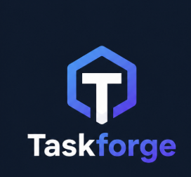
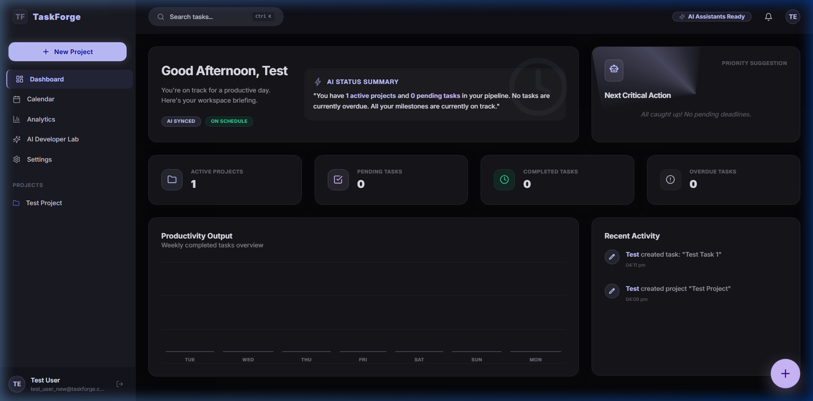
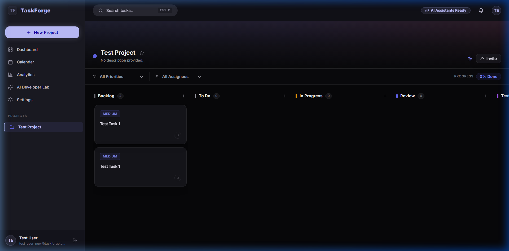
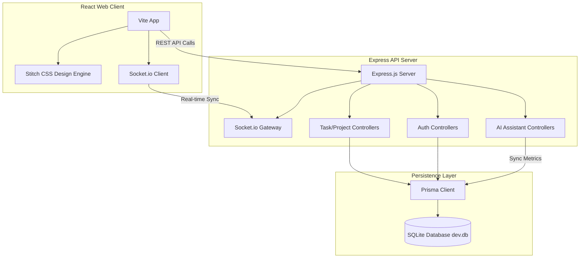

<p align="center">
  
</p>

# TaskForge

TaskForge is a collaborative, high-performance project management platform built with React, Node.js, Express, Socket.io, TypeScript, and Tailwind CSS. The interface is visual-crafted around the **Stitch Design System** featuring deep zinc canvases, transparent glassmorphism, responsive hover scales, and customized pastel accent indicators.

---

## 📸 Application Previews

### 📊 Interactive Dashboard
A dashboard displaying dynamic metrics, AI-calculated workspace briefings, priority suggestion cards, and a live activity feed.



### 📋 Real-time Kanban Board
Collaborative drag-and-drop workflow status updates backed by real-time Socket.io socket channels.



---

## 🏗️ System Architecture

The following diagram illustrates the data flow and technology stack layers within TaskForge:



---

## ⚡ Key Features

* **Stitch Design System**: Gorgeous dark theme design featuring glassmorphism elements, thin border boundaries, custom fonts (Inter/Geist), and micro-animations.
* **Real-time Collaboration**: Live task status updates and collaborative drag-and-drop triggers powered by Socket.io.
* **AI Lab & Action Suggestions**: Workspace summarizations and critical next-step suggestions based on database task priorities.
* **Floating Action Control (FAB)**: Absolute-positioned floating action trigger for creating new projects instantly from anywhere.
* **Zero-Setup Database**: Built-in SQLite database support for zero-configuration, immediate local development (data is persisted locally in the backend workspace `dev.db` file).

---

## 🚀 Getting Started

### 1. Unified Development Start
The root workspace is configured with `concurrently` to launch both frontend and backend development servers with a single command:

```bash
# In the root folder
npm install
npm run dev
```

The application will launch on:
- **Frontend App**: `http://localhost:5173`
- **Backend API**: `http://localhost:5000`

---

### 2. Manual Development Setup

If you prefer running the components individually:

#### Backend Server
```bash
cd backend
npm install
npx prisma generate
npx prisma migrate dev --name init
npm run prisma:seed
npm run dev
```

#### Frontend App
```bash
cd frontend
npm install
npm run dev
```

---

## 👥 Seed Accounts
Use these pre-seeded users to log in and inspect different role capabilities:

| User Name | Role | Email | Password |
| :--- | :--- | :--- | :--- |
| **Alice Vance** | Workspace Owner | `alice@taskforge.com` | `Password123!` |
| **Bob Miller** | Administrator | `bob@taskforge.com` | `Password123!` |
| **Charlie Zhang** | Member | `charlie@taskforge.com` | `Password123!` |
| **Diana Prince** | Viewer | `diana@taskforge.com` | `Password123!` |

